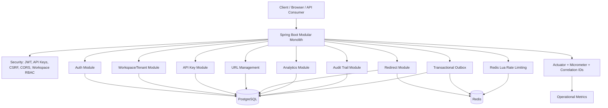

# AI-Assisted URL Shortener

**AI-Proficient Software Engineering Assessment**

This repository contains a production-oriented URL shortener implemented with Java 21 and Spring Boot 3.5. It was developed through an engineer-owned, spec-driven AI-assisted workflow: AI helped with planning, implementation, tests, review, and documentation, while the engineer retained responsibility for architecture, security, correctness, and release decisions.

## Key Capabilities

- User registration and login
- `USER` and `ADMIN` authorization
- Workspace tenant foundation with workspace RBAC
- Immutable application-level audit trail for enterprise mutations
- Workspace-bound machine API keys with scoped access
- Transactional outbox for durable URL mutation, cache invalidation, and optional analytics delivery
- RS256 JWT access tokens
- Rotating opaque refresh tokens stored only as SHA-256 digests
- Refresh-token reuse detection and token-family revocation
- CSRF protection for refresh/logout cookie flows
- URL creation with optional custom aliases
- Derived full short URL responses
- Optional idempotent URL creation with `Idempotency-Key`
- Destination editing with ETag / `If-Match` lost-update protection
- Expiration, enable/disable, and soft deletion
- Administrative URL blocking for abuse moderation
- Owner-scoped URL management without client-supplied owner IDs
- Workspace-scoped URL management through optional `X-Workspace-ID`
- Public redirect endpoint
- Redis cache-aside redirect lookup
- After-commit cache invalidation
- Bounded single-flight miss protection
- Click analytics with sanitized metadata
- Owner analytics and explicit admin analytics
- Redis Lua rate limiting
- Config-driven URL quotas
- Micrometer metrics and Spring Boot Actuator
- Correlation IDs
- Health, liveness, and readiness probes
- RFC7807-style Problem Details
- OpenAPI/Swagger
- Flyway migrations
- PostgreSQL and Redis Testcontainers
- GitHub Actions CI workflow
- JaCoCo coverage reporting
- k6 performance scripts

## Technology Stack

| Technology | Actual version/source |
| --- | --- |
| Java | 21 |
| Spring Boot | 3.5.0 |
| Spring MVC | Spring Framework 6.2.7 via Spring Boot |
| Spring Security | 6.5.0 via Spring Boot |
| Spring Data JPA | 3.5.0 via Spring Boot |
| PostgreSQL | `postgres:15-alpine` for Compose/Testcontainers; JDBC driver 42.7.5 |
| Redis | `redis:7-alpine`; Lettuce 6.5.5.RELEASE |
| Flyway | 11.7.2, including `flyway-database-postgresql` |
| Maven | Wrapper downloads Apache Maven 3.9.16 |
| Springdoc/OpenAPI | `springdoc-openapi-starter-webmvc-ui` 2.8.6 |
| Micrometer/Actuator | Micrometer 1.15.0, Spring Boot Actuator 3.5.0 |
| JUnit | 5.12.2 via Spring Boot test |
| Mockito | 5.17.0 via Spring Boot test |
| Testcontainers | 1.21.0 via Spring Boot dependency management |
| Docker | Docker Desktop/Engine required; local validation used Docker server 29.6.1 |
| GitHub Actions | `.github/workflows/ci.yml` |
| JaCoCo | 0.8.12 Maven plugin |
| k6 | Scripts in `performance/k6/`; local execution was not performed because k6 was unavailable |

## Architecture Overview



The application is a modular monolith to keep feature boundaries clear without adding distributed-system complexity. PostgreSQL is the source of truth for users, workspaces, memberships, URLs, refresh-token digests, API-key digests, analytics, and audit events. Redis is an optimization for redirect cache-aside and rate limiting; redirect correctness falls back to PostgreSQL when Redis is unavailable. Analytics are asynchronous and best-effort so redirect latency remains protected. Audit writes are synchronous in the same database transaction as the business mutation where practical. Tenant access is derived from workspace membership for humans and workspace-bound API-key scopes for machines.

Detailed architecture is in [docs/architecture/architecture-overview.md](docs/architecture/architecture-overview.md) and [docs/architecture/transactional-outbox.md](docs/architecture/transactional-outbox.md).

# Prerequisites

Docker must be running because integration tests start PostgreSQL and Redis through Testcontainers.

| Prerequisite | Verification command |
| --- | --- |
| Git | `git --version` |
| Java 21 JDK | `java -version` |
| Docker Desktop / Docker Engine | `docker --version` |
| Docker Compose | `docker compose version` |
| Maven | Maven wrapper is included; separate Maven install is not required |
| PowerShell | Required for Windows commands |
| Bash | Required for Unix/macOS commands and `scripts/verify.sh` |
| k6 | Optional; `k6 version` |

For Bash usage, ensure `JAVA_HOME` points to a JDK. The Windows Maven wrapper command `.\mvnw.cmd` works with Java on `PATH`.

# Environment Configuration

Use [.env.example](.env.example) as a variable-name template only. Do not commit real secrets.

| Variable | Required | Purpose | Example |
| --- | --- | --- | --- |
| `SPRING_PROFILES_ACTIVE` | Local recommended | Activate local profile | `local` |
| `APP_PUBLIC_BASE_URL` | Yes for deployed environments | Base URL used to derive `shortUrl` responses | `https://<service>.onrender.com` |
| `SPRING_DATASOURCE_URL` | Yes | PostgreSQL JDBC URL | `jdbc:postgresql://localhost:5432/shortener` |
| `SPRING_DATASOURCE_USERNAME` | Yes | Database username | `shortener` |
| `SPRING_DATASOURCE_PASSWORD` | Yes | Database password | `<database-password>` |
| `SPRING_DATA_REDIS_URL` | Production | Render Key Value / Redis URL | `<redis-or-valkey-url>` |
| `SPRING_REDIS_HOST` | Yes | Redis host | `localhost` |
| `SPRING_REDIS_PORT` | Yes | Redis port | `6379` |
| `SPRING_REDIS_TIMEOUT` | No | Redis command timeout | `2s` |
| `SPRING_REDIS_SSL` | No | Redis SSL toggle | `false` |
| `APP_AUTH_ISSUER` | Yes | JWT issuer | `url-shortener` |
| `APP_AUTH_AUDIENCE` | Yes | JWT audience | `url-shortener-api` |
| `APP_AUTH_KEY_ID` | Yes | JWT `kid` header value | `local-dev` |
| `APP_AUTH_PRIVATE_KEY_PEM` | Yes outside `test` | PKCS8 RSA private key PEM content | `<private-key-pem-from-secret-manager>` |
| `APP_AUTH_PUBLIC_KEY_PEM` | Yes outside `test` | X.509 RSA public key PEM content | `<public-key-pem-from-secret-manager>` |
| `APP_AUTH_ACCESS_TOKEN_TTL` | No | Access-token lifetime | `15m` |
| `APP_AUTH_REFRESH_TOKEN_TTL` | No | Refresh-token lifetime | `14d` |
| `APP_AUTH_ALLOWED_ORIGINS` | Yes for browser clients | CORS allowlist | `http://localhost:3000,http://localhost:8080` |
| `APP_AUTH_SECURE_COOKIES` | Yes by environment | Secure refresh cookie flag | `false` for local HTTP, `true` for HTTPS production |
| `APP_REDIRECT_CACHE_ENABLED` | No | Redirect cache toggle | `true` |
| `APP_REDIRECT_CACHE_TTL` | No | Eligible redirect cache TTL | `10m` |
| `APP_REDIRECT_CACHE_INELIGIBLE_TTL` | No | Disabled/expired/deleted cache TTL | `30s` |
| `APP_REDIRECT_CACHE_JITTER` | No | Cache TTL jitter | `30s` |
| `APP_REDIRECT_CACHE_SINGLE_FLIGHT_TIMEOUT` | No | Single-flight wait timeout | `2s` |
| `APP_REDIRECT_CACHE_SINGLE_FLIGHT_CAPACITY` | No | Single-flight in-flight key capacity | `1024` |
| `APP_ANALYTICS_PUBLISHER` | No | Analytics delivery mode: `local` or `outbox`; defaults to `local` | `local` |
| `APP_ANALYTICS_IP_HASH_PEPPER` | Yes for production | HMAC pepper for IP anonymization | `<analytics-hmac-pepper-from-secret-manager>` |
| `APP_ANALYTICS_QUEUE_CAPACITY` | No | Analytics queue capacity | `1000` |
| `APP_ANALYTICS_BATCH_SIZE` | No | Analytics batch size | `100` |
| `APP_ANALYTICS_FLUSH_INTERVAL` | No | Analytics flush interval | `1s` |
| `APP_ANALYTICS_OFFER_TIMEOUT` | No | Queue offer timeout | `10ms` |
| `APP_ANALYTICS_SHUTDOWN_FLUSH_TIMEOUT` | No | Shutdown flush timeout | `5s` |
| `APP_ANALYTICS_RETRY_COUNT` | No | Batch persistence retry count | `2` |
| `APP_ANALYTICS_TOP_LINKS_MAX` | No | Max admin top-links limit | `25` |
| `APP_IDEMPOTENCY_RETENTION` | No | Retention period for completed idempotency records | `24h` |
| `APP_IDEMPOTENCY_CLEANUP_INTERVAL` | No | Cleanup interval for expired idempotency records | `1h` |
| `APP_AUDIT_METADATA_MAX_BYTES` | No | Maximum serialized safe audit metadata size | `4096` |
| `APP_AUDIT_RETENTION` | No | Documented audit retention horizon; no destructive purge job is implemented | `3650d` |
| `APP_OUTBOX_ENABLED` | No | Enable transactional outbox dispatcher | `true` |
| `APP_OUTBOX_BATCH_SIZE` | No | Dispatcher claim batch size | `25` |
| `APP_OUTBOX_WORKERS` | No | Dispatcher worker count | `1` |
| `APP_OUTBOX_CLAIM_TIMEOUT` | No | Stale processing claim recovery window | `5m` |
| `APP_OUTBOX_MAX_ATTEMPTS` | No | Retry attempts before `DEAD` | `5` |
| `APP_OUTBOX_MAX_PAYLOAD_BYTES` | No | Maximum serialized outbox payload size | `8192` |
| `APP_RATE_LIMIT_ENABLED` | No | Rate-limit toggle | `true` |
| `APP_RATE_LIMIT_KEY_SALT` | Yes for production | Salt for hashed rate-limit keys | `<rate-limit-key-salt-from-secret-manager>` |
| `APP_RATE_LIMIT_REDIS_TIMEOUT` | No | Rate-limit Redis timeout setting | `250ms` |
| `APP_RATE_LIMIT_REGISTRATION_LIMIT` | No | Registration limit | `5` |
| `APP_RATE_LIMIT_REGISTRATION_WINDOW` | No | Registration window | `1m` |
| `APP_RATE_LIMIT_LOGIN_LIMIT` | No | Login limit | `5` |
| `APP_RATE_LIMIT_LOGIN_WINDOW` | No | Login window | `1m` |
| `APP_RATE_LIMIT_REFRESH_LIMIT` | No | Refresh limit | `30` |
| `APP_RATE_LIMIT_REFRESH_WINDOW` | No | Refresh window | `1m` |
| `APP_RATE_LIMIT_URL_CREATE_LIMIT` | No | URL creation limit | `60` |
| `APP_RATE_LIMIT_URL_CREATE_WINDOW` | No | URL creation window | `1m` |
| `APP_RATE_LIMIT_REDIRECT_LIMIT` | No | Public redirect limit | `600` |
| `APP_RATE_LIMIT_REDIRECT_WINDOW` | No | Public redirect window | `1m` |
| `APP_RATE_LIMIT_ADMIN_ANALYTICS_LIMIT` | No | Admin analytics limit | `120` |
| `APP_RATE_LIMIT_ADMIN_ANALYTICS_WINDOW` | No | Admin analytics window | `1m` |
| `SHORTENER_CODE_LENGTH` | No | Generated Base62 short-code length | `8` |
| `SHORTENER_CODE_MAX_RETRIES` | No | Bounded generation retry count | `5` |
| `SHORTENER_QUOTA_ENABLED` | No | URL quota toggle | `true` |
| `SHORTENER_QUOTA_DAILY_CREATIONS_PER_USER` | No | Daily creations per user | `10000` |
| `SHORTENER_QUOTA_MAX_ACTIVE_LINKS_PER_USER` | No | Maximum active links per user | `100000` |
| `SHORTENER_QUOTA_DAILY_CUSTOM_ALIASES_PER_USER` | No | Daily custom aliases per user | `1000` |
| `SPRING_DATASOURCE_HIKARI_MAXIMUM_POOL_SIZE` | No | Hikari max pool size | `10` |
| `SPRING_DATASOURCE_HIKARI_MINIMUM_IDLE` | No | Hikari minimum idle connections | `1` |
| `SPRING_DATASOURCE_HIKARI_CONNECTION_TIMEOUT` | No | Hikari connection timeout ms | `30000` |
| `SPRING_DATASOURCE_HIKARI_IDLE_TIMEOUT` | No | Hikari idle timeout ms | `300000` |
| `SPRING_DATASOURCE_HIKARI_MAX_LIFETIME` | No | Hikari max connection lifetime ms | `900000` |
| `PORT` | Render supplied | HTTP port | `8080` |
| `JAVA_TOOL_OPTIONS` | No | JVM heap/GC options | `-Xms64m -Xmx320m -XX:+UseG1GC` |
| `SERVER_MAX_HTTP_FORM_POST_SIZE` | No | Tomcat form body limit | `2MB` |
| `SERVER_MAX_SWALLOW_SIZE` | No | Tomcat swallow size limit | `2MB` |

Production requires strong values for RSA keys, analytics pepper, rate-limit salt, database credentials, and Redis credentials/network controls. Never commit real values.

## Generate Local RSA Keys

The implementation expects PEM content in environment variables, not key-file paths. The private key signs access tokens; the public key validates them. Generated local keys are development-only and must never be committed.

Generate keys with OpenSSL:

```powershell
openssl genpkey -algorithm RSA -pkeyopt rsa_keygen_bits:2048 -out local-jwt-private.pem
openssl rsa -pubout -in local-jwt-private.pem -out local-jwt-public.pem
```

Load them into PowerShell environment variables:

```powershell
$env:APP_AUTH_PRIVATE_KEY_PEM = (Get-Content .\local-jwt-private.pem -Raw).Replace("`r`n", "\n").Replace("`n", "\n")
$env:APP_AUTH_PUBLIC_KEY_PEM = (Get-Content .\local-jwt-public.pem -Raw).Replace("`r`n", "\n").Replace("`n", "\n")
```

Unix/macOS:

```bash
openssl genpkey -algorithm RSA -pkeyopt rsa_keygen_bits:2048 -out local-jwt-private.pem
openssl rsa -pubout -in local-jwt-private.pem -out local-jwt-public.pem
export APP_AUTH_PRIVATE_KEY_PEM="$(awk 'NF {sub(/\r/, ""); printf "%s\\n",$0;}' local-jwt-private.pem)"
export APP_AUTH_PUBLIC_KEY_PEM="$(awk 'NF {sub(/\r/, ""); printf "%s\\n",$0;}' local-jwt-public.pem)"
```

`.gitignore` excludes `local-jwt-*.pem`, `*.key`, and `*.p8`.

# Quick Start

## Windows - VS Code / PowerShell

1. Clone and enter the repository:

```powershell
git clone https://github.com/Amankapse/AI-Assisted-URL-Shortener.git
cd AI-Assisted-URL-Shortener
```

2. Verify Java and Docker:

```powershell
java -version
docker --version
docker compose version
```

3. Start infrastructure:

```powershell
docker compose up -d
docker compose ps
```

4. Generate/load local RSA keys, then set local environment variables:

```powershell
$env:SPRING_PROFILES_ACTIVE = "local"
$env:SPRING_DATASOURCE_URL = "jdbc:postgresql://localhost:5432/shortener"
$env:SPRING_DATASOURCE_USERNAME = "shortener"
$env:SPRING_DATASOURCE_PASSWORD = "shortener"
$env:SPRING_REDIS_HOST = "localhost"
$env:SPRING_REDIS_PORT = "6379"
$env:APP_AUTH_ISSUER = "url-shortener"
$env:APP_AUTH_AUDIENCE = "url-shortener-api"
$env:APP_AUTH_KEY_ID = "local-dev"
$env:APP_AUTH_ALLOWED_ORIGINS = "http://localhost:3000,http://localhost:8080"
$env:APP_AUTH_SECURE_COOKIES = "false"
$env:APP_ANALYTICS_IP_HASH_PEPPER = "local-development-only-change-me"
$env:APP_RATE_LIMIT_KEY_SALT = "local-development-rate-limit-salt"
```

5. Start the application:

```powershell
.\mvnw.cmd spring-boot:run
```

6. Verify health:

```powershell
Invoke-RestMethod http://localhost:8080/actuator/health
Invoke-RestMethod http://localhost:8080/actuator/health/liveness
Invoke-RestMethod http://localhost:8080/actuator/health/readiness
```

7. Open Swagger UI:

```text
http://localhost:8080/swagger-ui.html
```

## Unix/macOS

```bash
git clone https://github.com/Amankapse/AI-Assisted-URL-Shortener.git
cd AI-Assisted-URL-Shortener
java -version
docker --version
docker compose version
docker compose up -d
docker compose ps
```

After generating/loading local RSA keys:

```bash
export SPRING_PROFILES_ACTIVE=local
export SPRING_DATASOURCE_URL=jdbc:postgresql://localhost:5432/shortener
export SPRING_DATASOURCE_USERNAME=shortener
export SPRING_DATASOURCE_PASSWORD=shortener
export SPRING_REDIS_HOST=localhost
export SPRING_REDIS_PORT=6379
export APP_AUTH_ISSUER=url-shortener
export APP_AUTH_AUDIENCE=url-shortener-api
export APP_AUTH_KEY_ID=local-dev
export APP_AUTH_ALLOWED_ORIGINS=http://localhost:3000,http://localhost:8080
export APP_AUTH_SECURE_COOKIES=false
export APP_ANALYTICS_IP_HASH_PEPPER=local-development-only-change-me
export APP_RATE_LIMIT_KEY_SALT=local-development-rate-limit-salt
./mvnw spring-boot:run
```

## Docker Startup

`compose.yaml` starts infrastructure only:

- PostgreSQL on `localhost:5432`
- Redis on `localhost:6379`

The Compose file does not start the Spring Boot application container. Run the application from your IDE or Maven wrapper while PostgreSQL and Redis run in Docker.

## Live Deployment

The live demonstration deployment path uses:

```text
Render Web Service
  + Neon PostgreSQL
  + Render Key Value / Valkey
```

Deployment uses the existing Dockerfile and the `prod` Spring profile. Render supplies `PORT`; the application maps it through `server.port=${PORT:8080}`. Neon is configured through `SPRING_DATASOURCE_URL`, `SPRING_DATASOURCE_USERNAME`, and `SPRING_DATASOURCE_PASSWORD`. Render Key Value is configured through `SPRING_DATA_REDIS_URL`.

This is a live free-tier demonstration deployment, not the 100M-URLs/day hyperscale architecture target. Free-tier cold starts, memory limits, non-persistent cache/rate-limit state, and Neon capacity limits are documented separately.

See [docs/deployment/README.md](docs/deployment/README.md).

# Verify the Application

| Purpose | URL |
| --- | --- |
| Health | `http://localhost:8080/actuator/health` |
| Liveness | `http://localhost:8080/actuator/health/liveness` |
| Readiness | `http://localhost:8080/actuator/health/readiness` |
| OpenAPI JSON | `http://localhost:8080/v3/api-docs` |
| Swagger UI | `http://localhost:8080/swagger-ui.html` |

PowerShell:

```powershell
Invoke-RestMethod http://localhost:8080/actuator/health
Invoke-RestMethod http://localhost:8080/v3/api-docs
```

Bash:

```bash
curl -s http://localhost:8080/actuator/health
curl -s http://localhost:8080/v3/api-docs
```

# First API Workflow

The following PowerShell sequence uses actual request paths and DTO field names.

```powershell
$base = "http://localhost:8080"
$headers = @{ "Content-Type" = "application/json" }

$registerBody = @{
  email = "reader@example.com"
  password = "correct-horse-password"
} | ConvertTo-Json
Invoke-RestMethod -Method Post -Uri "$base/api/v1/auth/register" -Headers $headers -Body $registerBody

$loginBody = @{
  email = "reader@example.com"
  password = "correct-horse-password"
} | ConvertTo-Json
$auth = Invoke-RestMethod -Method Post -Uri "$base/api/v1/auth/login" -Headers $headers -Body $loginBody
$token = $auth.accessToken
$authHeaders = @{ Authorization = "Bearer $token"; "Content-Type" = "application/json" }

$expiresAt = (Get-Date).AddDays(7).ToString("yyyy-MM-ddTHH:mm:ss")
$createBody = @{
  originalUrl = "https://example.com/"
  customAlias = "demo-readme"
  expiresAt = $expiresAt
} | ConvertTo-Json
$url = Invoke-RestMethod -Method Post -Uri "$base/api/v1/urls" -Headers $authHeaders -Body $createBody
$url

curl.exe -i "$base/r/$($url.shortCode)"

Invoke-RestMethod -Method Get -Uri "$base/api/v1/urls/$($url.id)/analytics" -Headers @{ Authorization = "Bearer $token" }
Invoke-RestMethod -Method Get -Uri "$base/api/v1/urls/$($url.id)/analytics/daily" -Headers @{ Authorization = "Bearer $token" }
```

Admin analytics endpoints require an authenticated `ADMIN` user. There is no public admin creation endpoint.

# Authentication Overview

```text
Register
  -> Login
  -> RS256 access token
  -> Authorization: Bearer <token>
  -> Protected APIs
```

Refresh flow:

```text
Opaque refresh token
  -> Secure HttpOnly cookie
  -> CSRF-protected refresh/logout
  -> token rotation
  -> reuse detection revokes the token family
```

See [docs/security/authentication.md](docs/security/authentication.md) and [docs/architecture/adr/ADR-004-security-model.md](docs/architecture/adr/ADR-004-security-model.md).

# Database Migrations

Flyway runs automatically on application startup. PostgreSQL is authoritative and historical migrations are not edited.

| Migration | Purpose |
| --- | --- |
| `V1__initial_schema.sql` | Initial users, short URLs, click events, UUIDs, enums, indexes, constraints |
| `V2__authentication_refresh_tokens.sql` | Refresh-token table, token digest uniqueness, family/user indexes |
| `V3__click_analytics_indexes.sql` | Click analytics correlation ID, soft-delete support, analytics indexes |
| `V4__url_moderation_and_hyperscale_controls.sql` | Administrative blocked state and supporting index |
| `V5__idempotency_keys.sql` | Idempotency records for safe URL create retries |
| `V6__workspaces_and_memberships.sql` | Workspace tenancy, memberships, and workspace-scoped URL indexes |
| `V7__audit_events.sql` | Immutable application-level audit events with bounded JSONB metadata |
| `V8__api_keys.sql` | Workspace-bound API keys and API-key audit actions |
| `V9__outbox_events.sql` | Transactional outbox events, claim/retry fields, and dispatch indexes |

Migration files are in `src/main/resources/db/migration/`.

# Hyperscale Evolution

The current repository is the implemented, validated baseline. Hyperscale production components are documented as evolution targets, not local implementation claims.

Architecture targets include:

- 100,000,000 new URLs/day;
- about 1,157 average URL creations/sec;
- about 5,800 writes/sec at 5x peak;
- rounded design target of 10,000 creates/sec;
- minimum 10:1 read/write ratio;
- rounded redirect design target of 100,000 redirects/sec;
- 10-year retention, or about 365 billion URL records at target volume;
- redirect availability target of 99.99%;
- RPO <= 5 minutes and RTO <= 30 minutes as production architecture targets.

Implemented in this repository:

- configurable 8-character Base62 short-code generation;
- bounded collision retries with low-cardinality metrics;
- PostgreSQL unique constraint as the final concurrency-safe uniqueness guarantee;
- config-driven URL quotas;
- administrative block/unblock moderation;
- blocked redirect cache representation and invalidation.

Architecture-only future components:

- distributed URL mapping store such as DynamoDB, Cassandra, ScyllaDB, Bigtable, or equivalent;
- Redis Cluster;
- CDN/edge redirect layer;
- WAF/global load balancer;
- durable event stream such as Kafka, Kinesis, Pulsar, or equivalent;
- analytical warehouse such as ClickHouse, BigQuery, Snowflake, Druid, or equivalent;
- multi-AZ/multi-region infrastructure.

See [hyperscale NFRs](docs/requirements/hyperscale-nfr.md), [capacity model](docs/architecture/capacity-model.md), and [hyperscale evolution](docs/architecture/hyperscale-evolution.md).

# Testing

Docker must be running.

Windows:

```powershell
.\mvnw.cmd clean verify
```

Unix/macOS:

```bash
./mvnw clean verify
```

The verified suite count is recorded in [docs/testing/test-strategy.md](docs/testing/test-strategy.md). The build starts PostgreSQL and Redis Testcontainers automatically, runs Flyway migrations, validates Hibernate schema mappings, executes unit/integration/security/operation tests, builds the jar, and generates JaCoCo coverage.

# Coverage

Current JaCoCo results:

- Line coverage: 85.15%
- Branch coverage: 60.53%
- Report: `target/site/jacoco/index.html`

Coverage is quality evidence, not proof of correctness. See [docs/testing/coverage-summary.md](docs/testing/coverage-summary.md).

# Performance Testing

k6 scripts are provided in `performance/k6/`:

- `redirect-cache-hit.js`
- `redirect-cache-miss.js`
- `url-create.js`
- `login.js`
- `user-analytics.js`
- `admin-analytics.js`

Example:

```bash
k6 run performance/k6/redirect-cache-hit.js
```

Scripts use environment variables such as `BASE_URL`, `VUS`, `DURATION`, `ACCESS_TOKEN`, `ADMIN_ACCESS_TOKEN`, `SHORT_CODE`, and `URL_ID` depending on the scenario. Local measured results are not included because k6 was unavailable during final validation. See [docs/testing/performance-plan.md](docs/testing/performance-plan.md) and [docs/testing/performance-results.md](docs/testing/performance-results.md).

# CI/CD

GitHub Actions workflow: [.github/workflows/ci.yml](.github/workflows/ci.yml)

The workflow:

- checks out the repository
- configures Java 21
- uses Maven dependency caching
- verifies Docker availability
- runs `./mvnw clean verify`
- runs PostgreSQL and Redis Testcontainers through the test suite
- generates JaCoCo coverage
- uploads test and coverage artifacts
- validates Docker Compose configuration

Remote CI status is not claimed until the workflow runs on GitHub after push.

# Observability

Implemented observability includes:

- Actuator health endpoints
- Micrometer HTTP and application metrics
- bounded metric tags only; no user ID, URL ID, short code, email, IP address, token ID, or exception-message tags
- `X-Correlation-ID` propagation and sanitization
- liveness excluding PostgreSQL and Redis
- readiness requiring PostgreSQL and excluding Redis
- Redis cache/single-flight metrics
- transactional outbox backlog, retry/dead-letter, dispatch, and handler metrics
- authentication metrics
- analytics queue/event/batch metrics
- rate-limit accepted/rejected/failure metrics

See [docs/architecture/observability.md](docs/architecture/observability.md).

# Security

Security controls include:

- BCrypt password hashing
- RS256 JWTs with issuer, audience, expiration, signature, and required-claim validation
- `kid` emitted in the JOSE header
- opaque refresh tokens stored as SHA-256 digests
- refresh-token rotation and reuse detection
- workspace-bound API keys stored as HMAC-SHA-256 digests and accepted only through `X-API-Key`
- CSRF protection for refresh/logout cookie flows
- explicit CORS allowlist
- deny-by-default authorization
- workspace RBAC and IDOR protection through membership checks plus `workspace_id` repository/service scope
- immutable application-level audit events for URL, workspace, membership, and moderation mutations
- transactional outbox rows for durable URL mutation/cache invalidation events with bounded payloads
- API-key create/revoke audit events and API-key actor attribution on machine URL mutations
- Redis rate limiting
- HMAC analytics IP anonymization
- secure headers
- no sensitive Actuator endpoint exposure
- production secret values expected from environment/secret management

See [docs/security/authentication.md](docs/security/authentication.md), [docs/security/api-keys.md](docs/security/api-keys.md), and [docs/security/threat-model.md](docs/security/threat-model.md).

# Failure And Degradation Behavior

| Failure | Expected behavior |
| --- | --- |
| Redis cache unavailable | Redirect resolution falls back to PostgreSQL |
| Redis rate limiter unavailable | Endpoint-specific fail-open/fail-closed policy applies |
| PostgreSQL unavailable | Readiness reports DOWN; PostgreSQL-backed reads/writes fail safely |
| API key revoked/expired/invalid | Generic HTTP 401 Problem Details; raw key material is not logged |
| Outbox handler transient failure | Event retries with backoff until processed or moved to `DEAD` |
| Analytics queue full | Redirect succeeds; analytics event may be dropped |
| Refresh-token reuse | Token family is revoked and login is required |
| Invalid JWT | HTTP 401 Problem Details |
| Unauthorized workspace access | Workspace-scoped APIs return not-found or forbidden based on the operation; admin-only APIs return 403 for non-admin users |

# Known Limitations

- Analytics queue is best-effort and can drop events under overload.
- No durable Kafka/event broker.
- Transactional outbox provides durable database-backed delivery, but no external broker is implemented.
- Single-flight protection is JVM-local.
- No distributed single-flight or distributed lock.
- No external secret manager integration in the prototype.
- No Kubernetes deployment manifests.
- No multi-region architecture.
- Hyperscale distributed stores, CDN/edge, WAF, Redis Cluster, durable event streaming, OLAP warehouse, and multi-region infrastructure are documented but not implemented locally.
- Audit immutability is enforced by application behavior and append-only migration design, not by cryptographic chaining or WORM storage.
- k6 scripts exist, but local load results were not measured because k6 was unavailable.
- Remote CI status is pending until the branch is pushed and the workflow runs on GitHub.
- No public admin provisioning flow is implemented.

# AI-Assisted Engineering Approach

This project follows an engineer-owned AI-assisted development workflow:

1. Requirements were normalized into explicit specs and phases.
2. Architecture and implementation plans were proposed.
3. Human approval was required for high-risk decisions such as dependencies, migrations, authentication, authorization, and public API changes.
4. AI assisted implementation, tests, documentation, and review.
5. Generated output was reviewed and accepted, edited, or rejected.
6. Build, security, Docker/Testcontainers, and documentation evidence was recorded.
7. Traceability was maintained across prompts, decisions, artifacts, and validation.

Documented examples include:

- invalid `org.testcontainers:redis` dependency rejected and replaced with `GenericContainer<>("redis:7-alpine")`
- custom JWT filter approach replaced by Spring Security resource-server flow
- JWT `kid` handled in the JOSE header
- CSRF decisions reviewed around cookie-based refresh/logout
- Redis kept as an optimization rather than source of truth
- high-cardinality metric tags avoided
- late-stage heavy SAST/SCA tooling rejected to avoid destabilizing final validation

See [docs/ai-assisted-engineering/](docs/ai-assisted-engineering/).

# Repository Structure

```text
src/
  main/
    java/          Spring Boot application modules
    resources/     application config and Flyway migrations
  test/            unit, integration, security, and operation tests
docs/
  architecture/    architecture overview, diagrams, ADRs
  security/        authentication notes and threat model
  testing/         test strategy, coverage, performance, quality review
  operations/      runbook and rollback guide
  requirements/    normalized requirements, assumptions, acceptance criteria
  scenarios/       greenfield, brownfield, ambiguous scenarios
  ai-assisted-engineering/ traceability and approval logs
performance/
  k6/              reproducible k6 scripts
.github/
  workflows/       CI workflow
```

# Documentation Index

## Architecture

| Document | Purpose |
| --- | --- |
| [Architecture overview](docs/architecture/architecture-overview.md) | System structure and flows |
| [Component diagram](docs/architecture/component-diagram.md) | Mermaid component view |
| [Create URL sequence](docs/architecture/sequence-create-url.md) | Create flow |
| [Redirect sequence](docs/architecture/sequence-redirect.md) | Redirect/cache/analytics flow |
| [Authentication sequence](docs/architecture/sequence-authentication.md) | Auth flow |
| [Observability](docs/architecture/observability.md) | Metrics, Actuator, correlation IDs |
| [Transactional outbox](docs/architecture/transactional-outbox.md) | Durable event delivery design |
| [Rate limiting](docs/architecture/rate-limiting.md) | Redis Lua limiter design |
| [ADR-001 Modular monolith](docs/architecture/adr/ADR-001-modular-monolith.md) | Architecture decision |
| [ADR-002 PostgreSQL source of truth](docs/architecture/adr/ADR-002-postgresql-source-of-truth.md) | Persistence decision |
| [ADR-003 Redis cache-aside](docs/architecture/adr/ADR-003-redis-cache-aside.md) | Cache decision |
| [ADR-004 Security model](docs/architecture/adr/ADR-004-security-model.md) | Auth/security decision |
| [ADR-005 Click analytics](docs/architecture/adr/ADR-005-click-analytics.md) | Analytics decision |

## Security

| Document | Purpose |
| --- | --- |
| [Authentication and ownership](docs/security/authentication.md) | JWT, refresh, CSRF, ownership |
| [API key security](docs/security/api-keys.md) | Machine credentials, storage, scopes, rotation |
| [Threat model](docs/security/threat-model.md) | Threats, mitigations, residual risk |
| [Security ADR](docs/architecture/adr/ADR-004-security-model.md) | Security architecture decision |

## API

| Document | Purpose |
| --- | --- |
| [API notes](docs/api.md) | Endpoints, ownership, errors, operational endpoints |

## Testing

| Document | Purpose |
| --- | --- |
| [Test strategy](docs/testing/test-strategy.md) | Test tiers and validation evidence |
| [Coverage summary](docs/testing/coverage-summary.md) | JaCoCo coverage |
| [Test quality review](docs/testing/test-quality-review.md) | Test quality audit |
| [Performance plan](docs/testing/performance-plan.md) | k6 scenarios and targets |
| [Performance results](docs/testing/performance-results.md) | Local performance execution status |

## Operations

| Document | Purpose |
| --- | --- |
| [Deployment](docs/deployment/README.md) | Render, Neon, and Render Key Value deployment guide |
| [Runbook](docs/operations/runbook.md) | Startup and incident response |
| [Rollback guide](docs/operations/rollback.md) | Rollback policy |
| [Observability](docs/architecture/observability.md) | Health/readiness/metrics |
| [Rate limiting](docs/architecture/rate-limiting.md) | Limiter policies and failure behavior |

## AI-Assisted Engineering

| Document | Purpose |
| --- | --- |
| [Normalized requirements](docs/requirements/normalized-requirements.md) | Requirement decomposition |
| [Non-functional requirements](docs/requirements/non-functional-requirements.md) | NFRs |
| [Assumptions](docs/requirements/assumptions.md) | Explicit assumptions |
| [Acceptance criteria](docs/requirements/acceptance-criteria.md) | Acceptance criteria |
| [Greenfield scenario](docs/scenarios/01-greenfield.md) | Greenfield plan |
| [Brownfield scenario](docs/scenarios/02-brownfield.md) | Brownfield enhancement |
| [Ambiguous scenario](docs/scenarios/03-ambiguous.md) | Ambiguity handling |
| [Execution plan](docs/ai-assisted-engineering/execution-plan.md) | Phase plan |
| [Prompt log](docs/ai-assisted-engineering/prompt-log.md) | Significant prompts and results |
| [Traceability matrix](docs/ai-assisted-engineering/traceability-matrix.md) | Requirement/prompt/artifact mapping |
| [Human approval log](docs/ai-assisted-engineering/human-approval-log.md) | Approval evidence |

## Final Assessment

| Document | Purpose |
| --- | --- |
| [Final engineering summary](docs/final-engineering-summary.md) | Assessment narrative and evidence |
| [Release readiness checklist](docs/release-readiness-checklist.md) | Final audit and release checks |
| [Documentation index](docs/README.md) | Docs tree navigation |
