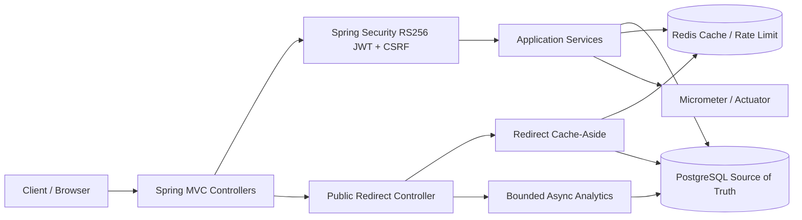

# AI-Assisted URL Shortener Assessment

Production-oriented URL shortener built for the AI-Proficient Software Engineering assessment track. The project demonstrates engineer-led AI-assisted development: AI was used to plan, draft, implement, test, review, and document, while architecture, correctness, security, and release approval remain human-owned.

## Project Summary

The application provides authenticated URL shortening with custom aliases, expiration, disable/enable, owner-scoped management, public redirects, Redis cache-aside redirect resolution, click analytics, admin analytics, rate limiting, operational metrics, and production-readiness documentation.

Technology stack:

- Java 21, Spring Boot 3.5, Maven
- Spring MVC, Spring Security, OAuth2 Resource Server
- PostgreSQL, Flyway, Hibernate/JPA
- Redis, Lettuce
- Spring Boot Actuator, Micrometer
- JUnit 5, Mockito, MockMvc, Testcontainers
- Docker Compose, GitHub Actions, JaCoCo, k6 scripts

## Key Capabilities

- Secure registration/login with BCrypt password hashes
- RS256 JWT access tokens with issuer, audience, expiry, and claim validation
- Opaque refresh-token rotation, digest storage, reuse detection, and CSRF-protected refresh/logout
- Owner-scoped URL APIs without client-supplied owner IDs
- Short URL creation, custom aliases, expiration, disable/enable, soft delete, and redirect behavior
- Redis cache-aside redirects with bounded TTLs, PostgreSQL fallback, and after-commit invalidation
- Bounded in-process single-flight protection for hot cache misses
- Asynchronous click analytics with sanitized IP/referrer/user-agent/correlation metadata
- Owner analytics and explicit admin analytics endpoints
- Redis Lua rate limiting with configurable policies
- Correlation IDs, RFC7807-style errors, security headers, liveness/readiness, and Micrometer metrics

## Architecture



The service is a modular monolith. PostgreSQL is authoritative. Redis is an optimization and is not required for redirect correctness where PostgreSQL is available.

## Quick Start

Prerequisites:

- Java 21
- Docker Desktop or compatible Docker runtime
- Git

Validate on Windows:

```powershell
.\mvnw.cmd clean verify
.\mvnw.cmd dependency:tree
docker compose config
```

Validate on Unix/macOS:

```bash
./mvnw clean verify
./mvnw dependency:tree
docker compose config
```

Start dependencies:

```powershell
docker compose up -d postgres redis
```

Build the application image:

```powershell
docker compose up --build
```

Local runtime requires valid RSA key environment variables. The `test` profile generates ephemeral test-only keys for reproducible tests.

## Configuration

Use `.env.example` as a variable-name template only. Do not commit real secrets.

Required production-sensitive settings include:

- `SPRING_DATASOURCE_URL`
- `SPRING_DATASOURCE_USERNAME`
- `SPRING_DATASOURCE_PASSWORD`
- `SPRING_REDIS_HOST`
- `APP_AUTH_PRIVATE_KEY_PEM`
- `APP_AUTH_PUBLIC_KEY_PEM`
- `APP_AUTH_KEY_ID`
- `APP_AUTH_ALLOWED_ORIGINS`
- `APP_AUTH_SECURE_COOKIES=true`
- `APP_ANALYTICS_IP_HASH_PEPPER`
- `APP_RATE_LIMIT_KEY_SALT`

## API

API notes are in [docs/api.md](docs/api.md). Generated OpenAPI is exposed at `/v3/api-docs`; Swagger UI is available at `/swagger-ui.html` when the application is running.

## Testing And Quality Evidence

Current validation:

- 72 tests passing
- PostgreSQL Testcontainers
- Redis Testcontainers
- Flyway V1, V2, V3 validation and application
- Hibernate schema validation
- MockMvc controller/security coverage
- Redis cache and rate-limit integration tests
- JaCoCo report generated during `verify`

Coverage details are recorded in [docs/testing/coverage-summary.md](docs/testing/coverage-summary.md). Test strategy is documented in [docs/testing/test-strategy.md](docs/testing/test-strategy.md).

## AI-Assisted Engineering

The project uses spec-driven AI assistance with human review gates. Evidence is recorded in:

- [docs/ai-assisted-engineering/execution-plan.md](docs/ai-assisted-engineering/execution-plan.md)
- [docs/ai-assisted-engineering/prompt-log.md](docs/ai-assisted-engineering/prompt-log.md)
- [docs/ai-assisted-engineering/traceability-matrix.md](docs/ai-assisted-engineering/traceability-matrix.md)
- [docs/ai-assisted-engineering/human-approval-log.md](docs/ai-assisted-engineering/human-approval-log.md)

The logs include accepted, edited, and rejected AI output, including invalid dependency suggestions, authentication design refinements, Flyway PostgreSQL module correction, and observability/rate-limit corrections.

## Security

Security controls include:

- Deny-by-default Spring Security configuration
- RS256 JWT validation with issuer, audience, expiration, signature, and required claims
- BCrypt password hashing
- Refresh-token digest storage, rotation, reuse detection, and family revocation
- CSRF protection for cookie-based refresh/logout
- Explicit CORS allowlist with no wildcard credentials
- Owner enforcement through JWT subject and service/repository scoping
- SSRF-oriented destination URL validation for schemes and private/link-local hosts
- Redis Lua rate limiting for registration, login, refresh, URL creation, redirects, and admin analytics
- RFC7807 safe error responses with correlation IDs and no stack traces
- No sensitive Actuator endpoints exposed
- Sanitized analytics storage; production HMAC pepper required under `prod`

Threats and residual risks are documented in [docs/security/threat-model.md](docs/security/threat-model.md).

## Production Considerations

- PostgreSQL is the source of truth.
- Redis outage increases database traffic but valid redirects can continue through PostgreSQL fallback.
- Rate-limit failure behavior is endpoint-specific and documented.
- Analytics ingestion is best-effort and bounded to protect redirect latency.
- In-process single-flight is JVM-local; horizontal scaling needs distributed coordination if this becomes a bottleneck.
- Production deployment should use managed PostgreSQL/Redis, external secret management, centralized logs/metrics/traces, and infrastructure DDoS controls.

## Limitations

- No durable event broker; analytics can drop events under sustained overload.
- No distributed single-flight or distributed lock.
- k6 scripts exist, but local k6 execution was unavailable in this environment.
- No multi-region deployment or Kubernetes manifests.
- No external secret manager integration in the prototype.
- Registration duplicate responses can still reveal an already-registered email.
- CI workflow is defined, but remote CI execution must be verified after push.

## Documentation Index

- [Final engineering summary](docs/final-engineering-summary.md)
- [Architecture overview](docs/architecture/architecture-overview.md)
- [ADRs](docs/architecture/adr)
- [API notes](docs/api.md)
- [Testing strategy](docs/testing/test-strategy.md)
- [Test quality review](docs/testing/test-quality-review.md)
- [Coverage summary](docs/testing/coverage-summary.md)
- [Performance plan](docs/testing/performance-plan.md)
- [Performance results](docs/testing/performance-results.md)
- [Release readiness checklist](docs/release-readiness-checklist.md)
- [Security authentication notes](docs/security/authentication.md)
- [Threat model](docs/security/threat-model.md)
- [Operational runbook](docs/operations/runbook.md)
- [Rollback guide](docs/operations/rollback.md)
- [AI traceability](docs/ai-assisted-engineering/traceability-matrix.md)
