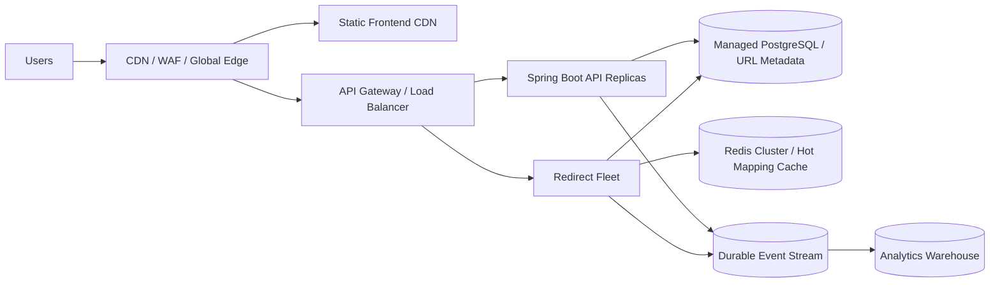

# Architecture Overview

The URL shortener is designed as a modular monolith with clear feature boundaries. The solution prioritizes security, observability, and operational readiness while keeping the application deployable as a single artifact.

## Main components

- API gateway/entrypoint: Spring Boot REST controllers exposing `/api/v1`
- Workspace tenancy: `CurrentOwnerProvider` supplies the authenticated actor and workspace authorization resolves `X-Workspace-ID` or the default workspace before repository operations
- Workspace RBAC: roles are `OWNER`, `ADMIN`, `EDITOR`, `ANALYST`, and `VIEWER`; platform roles remain separate
- Authentication: short-lived RS256 JWT access tokens in `Authorization: Bearer`, opaque refresh tokens in Secure HttpOnly cookies, and workspace-bound API keys in `X-API-Key`
- URL Service: business logic for creating, resolving, and managing short URLs
- Quota Service: config-driven resource allowance checks for daily creations, active links, and custom aliases
- Redirect Service: Redis cache-aside short-code resolution backed by PostgreSQL, with safe PostgreSQL fallback on Redis failure
- Analytics Service: best-effort async click event capture, sanitized metadata, and per-link/admin analytics
- Audit Trail: append-only PostgreSQL audit events for URL, workspace, membership, and moderation mutations
- API Key Service: machine credential creation, digest verification, revocation, scope enforcement, and API-key audit events
- Transactional Outbox: PostgreSQL-backed at-least-once delivery for URL mutation events, durable cache invalidation, and optional analytics event publishing
- Data layer: PostgreSQL for source-of-truth persistence
- Cache layer: Redis for redirect optimization; PostgreSQL remains authoritative
- Observability: Actuator health/liveness/readiness, ADMIN-protected metrics, bounded Micrometer application meters, correlation IDs, and safe structured logging context
- Rate limiting: Redis Lua fixed-window policies with documented fail-open/fail-closed behavior
- Moderation: explicit ADMIN block/unblock operations; blocked links return safe not-found behavior on redirect

## Data flow

1. User requests create link through `/api/v1/urls`.
2. Application validates destination URL and optional alias.
3. Service resolves the current actor from `CurrentOwnerProvider`, then resolves the target workspace membership.
4. Service checks workspace URL quotas, generates or validates a short code, and persists the link to PostgreSQL with `workspace_id`; `owner_id` remains creator metadata.
5. Public redirect requests use `/r/{shortCode}` and resolve the link from Redis when a valid cache entry exists.
6. Cache misses, malformed cache entries, Redis failures, and ineligible cached entries fall back to PostgreSQL.
7. Valid redirects enqueue a best-effort analytics event. Batch persistence inserts immutable click events and atomically increments `short_urls.click_count`.
8. URL disable, enable, destination update, expiration update, delete, block, and unblock publish immediate after-commit cache invalidation and durable outbox cache-invalidation work.
9. URL mutations also insert same-transaction outbox events for downstream delivery. The dispatcher claims rows with PostgreSQL `FOR UPDATE SKIP LOCKED`, retries transient handler failures, and moves exhausted events to `DEAD`.
10. Mutating URL, workspace, membership, moderation, and API-key management operations insert bounded audit metadata in the same PostgreSQL transaction as the business mutation where practical.

## Security flow

- Protected APIs require either a JWT bearer token or an API key where explicitly allowed by the security rules.
- `USER` can manage only workspace resources permitted by membership role.
- `ADMIN` does not become workspace admin and does not bypass workspace URL APIs; privileged behavior is exposed through explicit admin analytics and moderation endpoints.
- API keys are limited to one workspace and explicit scopes. They cannot manage workspaces, members, API keys, auth sessions, or platform admin APIs.
- CSRF is not required for stateless access-token API requests because the bearer token is not automatically attached by the browser. Refresh and logout endpoints using cookie-based refresh tokens are protected against CSRF.
- Refresh tokens are opaque random values; only SHA-256 digests are stored in PostgreSQL. Rotation creates a replacement token in the same family, and reuse of a revoked token revokes the active family.
- API keys are opaque bearer credentials; only prefix plus HMAC-SHA-256 digest are stored in PostgreSQL, and raw key material is returned once.

## Operational flow

- Liveness reports JVM/application state and intentionally excludes PostgreSQL and Redis.
- Readiness requires PostgreSQL because it is the source of truth and intentionally excludes Redis because redirect cache and selected limiter failures degrade without breaking correctness.
- Redis cache, single-flight, analytics, authentication, and rate-limit telemetry are emitted through Micrometer with bounded tags only.
- Soft deletion preserves historical analytics while making deleted links unavailable through normal workspace and redirect queries.
- Administrative blocking preserves analytics history and prevents redirects without allowing owners to unblock through normal enable operations.
- Audit records are append-only through application behavior. The audit table intentionally avoids cascading foreign keys so historical records survive user, URL, or workspace lifecycle changes. Cryptographic immutability and WORM storage remain production-evolution options.
- Outbox records are operational delivery work items, not audit evidence. Liveness/readiness do not depend on the dispatcher; PostgreSQL readiness already protects the source of truth.

## Live deployment architecture

The Render deployment is a live demonstration environment, not the hyperscale target.

```mermaid
flowchart LR
    Browser[Browser] --> Backend[Render Web Service<br/>Angular static assets + Spring Boot]
    Browser --> Redirects[Public /r/{shortCode}]
    Redirects --> Backend
    Backend --> Neon[(Neon PostgreSQL<br/>source of truth)]
    Backend --> Valkey[(Render Key Value / Valkey<br/>cache and rate limits)]
```

The Docker build keeps source code separated under `frontend/` and `src/`, builds Angular first, copies only `frontend/dist/frontend/browser` into Spring Boot static resources inside the image build, and packages one executable JAR. The Spring Boot service serves `/`, `/login`, `/register`, and `/app/**` as Angular SPA entry points while `/api/v1/**`, `/r/**`, `/actuator/**`, `/swagger-ui/**`, and `/v3/api-docs/**` remain backend routes. Production secrets are read at runtime from environment variables; frontend `app-config.json` contains only public browser-visible values.

## Production-scale architecture target

The documented 100M-new-URLs/day evolution would split traffic and storage differently:



This target requires managed multi-AZ infrastructure, distributed cache coordination, durable event streaming, edge caching, centralized observability, and formal autoscaling. It is intentionally documented as production evolution rather than claimed as implemented in the current single-artifact deployment.

## Hyperscale evolution boundary

The current implementation remains a single Spring Boot artifact backed by PostgreSQL and Redis. The 100M-new-URLs/day target requires evolution toward independently scalable redirect fleets, distributed URL mapping storage, Redis Cluster, CDN/edge caching, WAF/global load balancing, durable event streaming, analytical warehouse separation, and multi-AZ/multi-region infrastructure. These are documented in [hyperscale evolution](hyperscale-evolution.md) and are not implemented locally.
