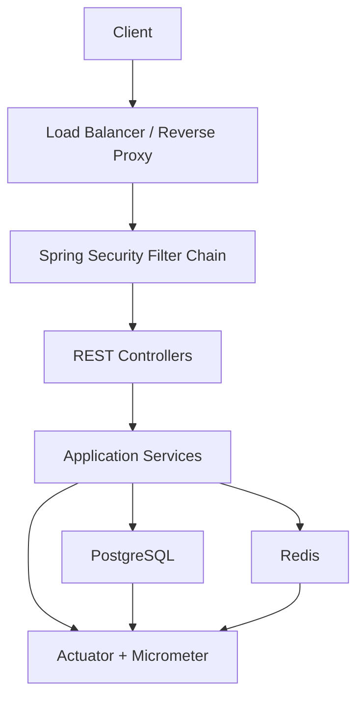

# Component Diagram

```mermaid
flowchart TB
    Client[Client]
    LB[Load Balancer / Reverse Proxy]
    AuthFilter[Spring Security Filter Chain]
    REST[REST Controllers]
    Services[Application Services]
    DB[PostgreSQL]
    Cache[Redis]
    Observability[Actuator + Micrometer]

    Client --> LB
    LB --> AuthFilter
    AuthFilter --> REST
    REST --> Services
    Services --> DB
    Services --> Cache
    Services --> Observability
    DB --> Observability
    Cache --> Observability
```