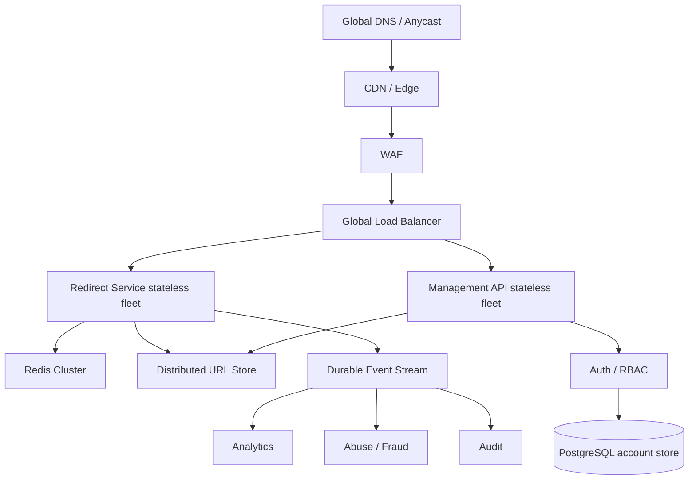

# Hyperscale Evolution

The current repository is a production-grade, validated implementation baseline. Hyperscale components such as distributed URL storage, Redis Cluster, CDN/edge routing, Kafka/event streaming, multi-AZ/multi-region infrastructure, WAF, and analytical warehouses are documented as evolutionary production architecture and are not locally implemented.



## Redirect Path

The redirect path should scale independently from management/write traffic. It should be stateless, horizontally scalable, and optimized for short-code lookup by using edge/CDN caching, Redis Cluster, and a distributed URL mapping store.

## CDN And Edge

Benefits:

- lower redirect latency;
- absorbs viral traffic;
- reduces origin load;
- provides DDoS and geographic routing integration.

Trade-off:

- backend may not observe every redirect.

Analytics must therefore be sourced from edge logs/events or durable ingestion, not only origin application callbacks.

## Hot-Link Handling

A single viral shortcode can be dramatically hotter than average traffic. Mitigations:

- CDN/edge caching;
- Redis hot-key detection;
- replicated cache reads;
- local micro-cache where justified;
- stale-while-revalidate;
- probabilistic early refresh;
- adaptive TTL;
- abuse/DDoS controls.

The current JVM-local single-flight protects only requests inside one application instance.

## Redis Production Topology

Target:

```text
Redis Cluster
|-- sharded primary nodes
|-- replicas/failover
```

Requirements:

- cache hit ratio metrics;
- hot-key detection;
- bounded TTL and jitter;
- memory limits;
- failover;
- eviction policy;
- no correctness dependency.

PostgreSQL/current store fallback remains required.

## Infrastructure Requirements

Production target infrastructure includes stateless horizontal scaling, load balancer, WAF, CDN, container orchestration, rolling/canary deployments, auto-scaling, backward-compatible migrations, multi-AZ deployment, centralized secrets, and centralized logging/metrics/tracing.
