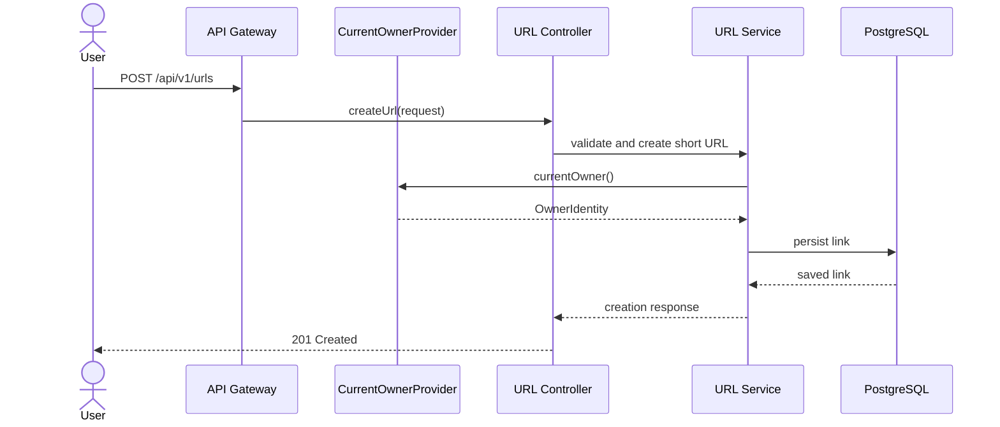

# Sequence: Create URL

```mermaid
sequenceDiagram
    actor User
    participant API as API Gateway
    participant Owner as CurrentOwnerProvider
    participant UrlCtrl as URL Controller
    participant UrlSvc as URL Service
    participant DB as PostgreSQL

    User->>API: POST /api/v1/urls
    API->>UrlCtrl: createUrl(request)
    UrlCtrl->>UrlSvc: validate and create short URL
    UrlSvc->>Owner: currentOwner()
    Owner-->>UrlSvc: OwnerIdentity
    UrlSvc->>DB: persist link
    DB-->>UrlSvc: saved link
    UrlSvc-->>UrlCtrl: creation response
    UrlCtrl-->>User: 201 Created
```
