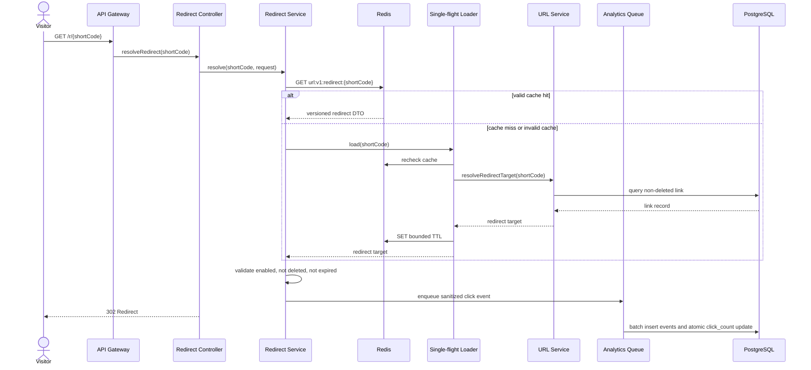

# Sequence: Redirect

```mermaid
sequenceDiagram
    actor Visitor
    participant API as API Gateway
    participant RedirectCtrl as Redirect Controller
    participant RedirectSvc as Redirect Service
    participant Redis as Redis
    participant SingleFlight as Single-flight Loader
    participant UrlSvc as URL Service
    participant Analytics as Analytics Queue
    participant DB as PostgreSQL

    Visitor->>API: GET /r/{shortCode}
    API->>RedirectCtrl: resolveRedirect(shortCode)
    RedirectCtrl->>RedirectSvc: resolve(shortCode, request)
    RedirectSvc->>Redis: GET url:v1:redirect:{shortCode}
    alt valid cache hit
        Redis-->>RedirectSvc: versioned redirect DTO
    else cache miss or invalid cache
        RedirectSvc->>SingleFlight: load(shortCode)
        SingleFlight->>Redis: recheck cache
        SingleFlight->>UrlSvc: resolveRedirectTarget(shortCode)
        UrlSvc->>DB: query non-deleted link
        DB-->>UrlSvc: link record
        UrlSvc-->>SingleFlight: redirect target
        SingleFlight->>Redis: SET bounded TTL
        SingleFlight-->>RedirectSvc: redirect target
    end
    RedirectSvc->>RedirectSvc: validate enabled, not deleted, not expired
    RedirectSvc->>Analytics: enqueue sanitized click event
    RedirectCtrl-->>Visitor: 302 Redirect
    Analytics->>DB: batch insert events and atomic click_count update
```
